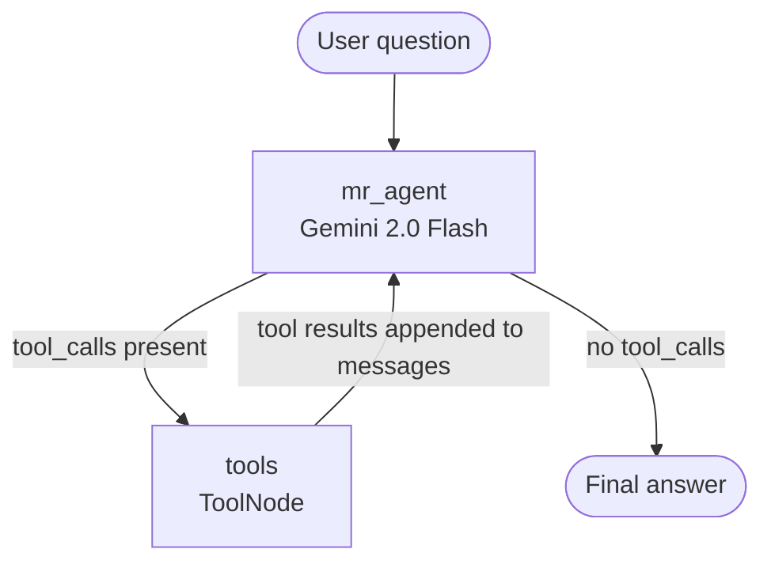

# Multi-Step ReAct Agent on GAIA Benchmark


A multi-step ReAct agent evaluated on the [GAIA benchmark](https://huggingface.co/datasets/gaia-benchmark/GAIA), built with **LangGraph** and **Google Gemini 2.0 Flash**. The agent autonomously selects and chains tools across multiple reasoning steps to answer factual, multi-modal, and research questions.

🔗 **Live demo:** [Hugging Face Space](https://huggingface.co/spaces/maldu/multi-step-agent-on-gaiads)

---

## What is GAIA?

GAIA (General AI Assistants) is a benchmark designed to evaluate general-purpose AI assistants on real-world tasks that require reasoning, multi-step tool use, and common sense. Questions span web research, file parsing, code execution, chess analysis, and more — and are intentionally difficult for LLMs to answer directly.

---

## Architecture

The agent implements the **ReAct pattern** (Reason + Act) as a stateful graph using LangGraph. On each step it either produces a final answer or calls one or more tools; tool results are fed back as new messages and the loop continues until no further tool calls are made.



**State** — a simple `AgentState` TypedDict that holds the full conversation as a list of `BaseMessage` objects. LangGraph's `add_messages` reducer automatically appends each new message rather than replacing the list, so the agent retains the complete reasoning trace.

**Agent node (`mr_agent`)** — calls Gemini 2.0 Flash with the system prompt and the current message history. The model decides whether to answer directly or call a tool. A retry wrapper with exponential back-off handles API rate limits (HTTP 429).

**Tool node (`tools`)** — a LangGraph `ToolNode` that executes whichever tools the model called and returns their outputs as `ToolMessage` objects, ready for the next model pass.

**Routing** — `should_continue` inspects `last_message.tool_calls`: if empty the graph routes to `END`; otherwise it routes back through the tool node.

---

## Tools

| Tool | Purpose |
|---|---|
| `tavily_search` | Live web search via Tavily (excludes Wikipedia to force dedicated wiki tool) |
| `wiki_tool` | Wikipedia lookup via LangChain `WikipediaQueryRun` |
| `arxiv_tool` | ArXiv paper search via LangChain `ArxivQueryRun` |
| `add` / `multiply` | Integer arithmetic for numeric reasoning tasks |
| `is_reversed` | Detects and reverses backwards-written questions |
| `extract_chess_move_from_image` | Fetches a chess board image from the GAIA API and returns the best move |
| `excel_file_sales` | Downloads an attached Excel file, parses it with openpyxl, and sums food-category sales |
| `python_code_reader` | Downloads and executes an attached Python script, returning its numeric output |
| `youtube_bird_species_counter` | Returns the maximum number of bird species seen simultaneously in a target YouTube video |
| `surnames_equine_veterinarians` | Answers a specific GAIA chemistry-textbook question about an equine vet |
| `grocery_list` | Builds a botanically-correct vegetable list (excludes botanical fruits like tomatoes) |

---

## System Prompt

The agent is instructed to minimise formatting noise in its answers, which is critical for GAIA's exact-match scoring:

```
You are a general AI assistant.
I will ask you a question. Use tools if available. Only stop when you're sure you have the final answer.
Return the answer without any template.
The final answer should be a number OR as few words as possible OR a comma separated list of numbers and/or strings.
If you are asked for a number, return only the number without comma, units as € unless specified.
If you are asked for a string, don't use articles, neither abbreviations (e.g. for cities),
and write the digits in plain text unless specified otherwise.
If you are asked for a comma separated list, apply the above rules depending on whether the
element to be put in the list is a number or a string.
```

---

## Project Structure

```
.
├── app.py              # Gradio UI + BasicAgent class (production entry point)
├── agent.py            # Standalone agent graph (development / experimentation)
├── requirements.txt    # Python dependencies
├── .env.example        # Required environment variables (copy to .env)
├── data/
│   └── metadata.jsonl  # Local GAIA validation metadata
└── notebooks/
    ├── gaia_exploration.ipynb   # Dataset analysis and question categorisation
    ├── fetch_questions.ipynb    # API exploration, file attachments, multimodal tasks
    └── react_agent.ipynb        # End-to-end agent testing on individual GAIA questions
```

---

## Setup

### 1. Clone and create a virtual environment

```bash
git clone https://huggingface.co/spaces/maldu/multi-step-agent-on-gaiads
cd multi-step-agent-on-gaiads
python3.10 -m venv agentsvenv
source agentsvenv/bin/activate
```

### 2. Install dependencies

```bash
pip install -r requirements.txt
```

### 3. Configure environment variables

```bash
cp .env.example .env
# Edit .env and fill in your API keys
```

You will need:
- **Google Gemini API key** — [aistudio.google.com](https://aistudio.google.com/app/apikey)
- **Tavily API key** — [app.tavily.com](https://app.tavily.com)
- **Hugging Face token** — [huggingface.co/settings/tokens](https://huggingface.co/settings/tokens)

### 4. Log in to Hugging Face CLI

```bash
huggingface-cli login
```

This is required locally because `gr.LoginButton()` mocks the HF OAuth flow using your cached credentials.

### 5. Run locally

```bash
python app.py
```

Then open [http://localhost:7860](http://localhost:7860), log in with your Hugging Face account using the button in the UI, and click **Run Evaluation & Submit All Answers**.

---

## How the Evaluation Works

1. The app fetches all questions from the [GAIA scoring API](https://agents-course-unit4-scoring.hf.space).
2. A fresh `BasicAgent` instance is created for each question to avoid state leakage.
3. The agent runs the full ReAct loop and returns a final answer string.
4. All answers are submitted in a single batch to the scoring endpoint, which returns the overall accuracy.
5. A 15-second cooldown between questions prevents Gemini free-tier rate limiting.

---

## Key Design Decisions

**Why LangGraph over a bare LangChain `AgentExecutor`?** LangGraph exposes the graph explicitly, making it straightforward to add new nodes (e.g. a reflection step, a retrieval-augmented memory node) without rewriting the agent loop. The state is also inspectable at every step, which is useful for debugging GAIA failures.

**Why Gemini 2.0 Flash?** It has a strong tool-calling API, a long context window (useful for multi-turn traces), and a generous free tier — important when running 20+ questions sequentially.

**Why task-specific tools instead of a generic code executor for everything?** GAIA's file-attachment tasks involve downloading binary files (images, Excel, audio) from an external API. Wrapping each in a dedicated tool with hardcoded task IDs was the most reliable approach for the benchmark, even if it is less generalisable.
